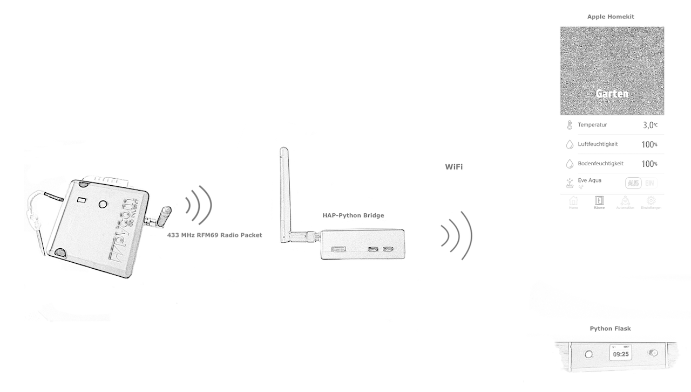

# HAP-Python-Packet-Bridge

Python Homebridge for 433 MHz based sensors and actors .



This repository put together the HAP-Python code from <https://github.com/ikalchev/HAP-python> and the chip driver  <https://github.com/adafruit/Adafruit_CircuitPython_RFM69> with some modification.

## Installation

install HAP-Python

```
pip3 install HAP-python[QRCode]
```

* copy "main.py", "rfm69_driver.py", "Transceiver.py", "Devices.py" and "Devices.json" to you prefered path.
* Prepare/modify "Devices.py" and "Device.json" with your own devices.
* Create your own remote devices, see "sensor_example".

All is tested with a Raspberry Pi Zero W as a bridge and 3 devices, based on Adafruit Feather 433 MHz RFM69 (M0 SAMD21 mcu and 32u4 mcu).

## Working principle (Device.json, Devices.py and main.py)

"Device.json" have to contain all device, you like to use. Formating the content of "Device.json" json-like and append each device "{"device name": node number1, "device name": node number}". The "device name" have to correspond to the class name in "Device.py". Once defined, the "main.py" will read "Devices.json", load all definition and publish them to the Apple Homekit. For testing, you can bypass the automatic, see "main.py" function "get_bridge()". The communication to 433 Mhz binded devices is separated in "Transceiver.py" and will started automatically.

## one way or two way communication - Transceiver.py

The 433 MHz packet communication is separated in "Transceiver.py". Incomimg data are detected by interrupt (here GPIO(BCM) 24) and cached in a dictionary to prevent useless network traffic.

### one way - classes example CATEGORY_SENSOR

The mcu device itself send data in a needed interval - see "sensor example". The transceiver store the data in a dictionary.
The bridge HAP side check continously the transceiver cache, here in a 30 seconds interval, and push the values to the homekit - see AM2302 class as example. This helps to preserve capacity on battery powered devices, because this devices can go into deep sleep until the next, self defined, send action.

### two way - class example CATEGORY_SWITCH

Switches often operate manually and per software in parallel. Here, we using "FF" for a status request, "0" for Off, "1" for On and let confirm each action by the mcu. Additional on bridge startup, the switch start state will be checked - see class "WaterPump" and the corresponding "switch.cpp" for the mcu, how it can work.

## RFM69 driver

"rfm69_driver" is a modied driver version for the RFM69 chip set to work with interupts instead of continuously checking the chip buffer. 