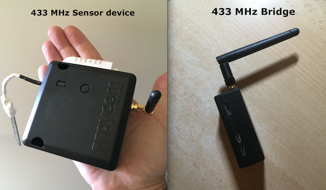

# HAP-Python-Packet-Radio

Python Homebridge and 433 MHz Sensors - measuring Soil Humidity, Air Humidity and Temperature and send data to the Apple Homekit.

This repository put together the HAP-Python code from https://github.com/ikalchev/HAP-python and  https://github.com/adafruit/Adafruit_CircuitPython_RFM69 with some modification.
Use the linked repository to install these basic libraries. 

It is tested with a Adafruit Feather M0 RFM69HCW for sensoring and Raspberry Pi Zero W as a bridge.
Put the files into your prefered path. Instead of "main.py", delivered by HAP-Python, use "ansync_main.py" to startup.

1) HAP-Python modification
    - separate the homebridge communication from the sensor communication
    - data buffering and handover by global variable, no "pickle" or other methods needed

2) Adafruit Circuit Python RFM69 library modification

    - instead of permament looping to read the FIFO buffer, i use the GPIO event state to detect incoming data

3)  additional (if needed)

    - send the sensor data to other http connected units

The sensor device sends each 30 minutes a set of data (Humidity, Temperature, Battery Charge) in a json-like format. Incoming data on the bridge are detected by GPIO event. After sending data, the sensor device move to deep sleep mode to preserve battery capacity. Because of Apple Homekit could check the sensor state each time, the data are stored into a global variable and will be refreshed by the sensor device each 30 minutes. 

The actually Adafruit driver version doesnt support the RHReliableDatagram functions. In case of bad transmissions, the handling of "bad packets" can leads into long cycles of send/receive actions until the packet is reliable transmitted, that could drain the battery fast. Because of that, on the sensor side i use the RHDatagram library, a bit higher "Reliability" than the pure RHGeneric driver, but without SEND/ACK etc.
By using the GPIO event control, it's a good idea to debounce the signal detection on the receiver. 200ms works good for me.
