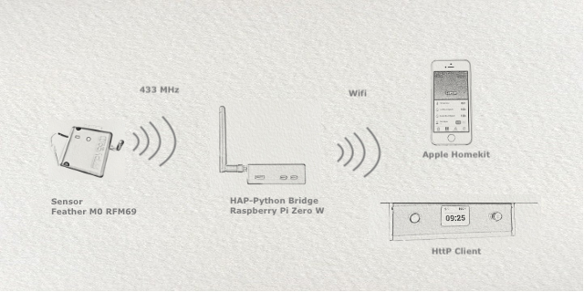

# HAP-Python-Packet-Radio

Python Homebridge and 433 MHz Sensors - measuring Soil Humidity, Air Humidity and Temperature and send data to the Apple Homekit and other http connected devices.

This repository put together the HAP-Python code from https://github.com/ikalchev/HAP-python and the chip driver  https://github.com/adafruit/Adafruit_CircuitPython_RFM69 with some modification.
Use the linked repository to install these basic libraries. 

It is tested with a Adafruit Feather M0 RFM69HCW for sensoring and Raspberry Pi Zero W as a bridge.
Put the files into your prefered path. Instead of "main.py", delivered by HAP-Python, use "async_main.py" to startup.

## Significant changes/modification

### HAP-Python
* separate the homebridge communication from the sensor communication
* data buffering and handover by global variable, no "pickle" or other methods needed

The sensor device measure and send data each 30 minutes in a json-like format (see sensor_example), then go into "deep sleep mode" to save battery capacity. The bridge detect incoming data by GPIO event. The Apple Homekit app (user GUI) could check the sensor state at any time. Because of a probably sleeping device the last/actually data are stored on the bridge. 

### Adafruit CPython RFM69 driver

* instead of permament looping to read the buffer, GPIO event state is used to detect incoming data

Permanent looping to check the PayloadReady, push the cpu usage of a single core Raspberry Zero up to 100 percent permanently. I use the DIO port and GPIO event to detect incoming data. As tested, debouncing with around 200 ms helps to prevent "bad packets" (mostly seen as packets with wrong sizes).

### additional (if needed)

* send the sensor data to other http connected units
